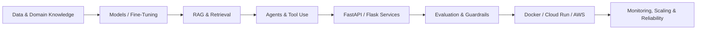

<!--
  GitHub Profile README for github.com/iamvrajpatel
  Keep the top section concise: recruiters should understand your profile in <10 seconds.
-->

<p align="center">
  
</p>

<div align="center">

### Building production AI systems — from data and models to agents, APIs, evaluation, and cloud deployment

**LLMs · RAG · Agentic AI · Computer Vision · OCR · LLMOps · Production AI · Financial Engineering**

<br/>

[](https://linkedin.com/in/iamvrajpatel)
[](https://drive.google.com/file/d/16BB7ROtyk00IBcnZZiTDmR_rhydz1nSP/view?usp=sharing)
[](https://leetcode.com/u/ervrajpatel)
[](https://codeforces.com/profile/vraj2111)
[](mailto:vjp21112@gmail.com)

</div>

---

## 👨‍💻 About Me

I am an **AI / Applied AI Engineer with 2+ years of experience** building production-oriented systems across **Large Language Models, Retrieval-Augmented Generation, agentic AI, computer vision, OCR, LLM evaluation, and workflow automation**.

My work sits at the intersection of **AI research ideas and production engineering**: model adaptation, retrieval, agent orchestration, backend APIs, evaluation, observability, latency/throughput optimization, and cloud deployment.

```text
Current role      AI Engineer / Data Scientist — HubbleHox Technologies | Ampersand Group
Graduate study    M.S. Financial Engineering — WorldQuant University (2025–2027 expected)
Engineering       Python · FastAPI · Flask · Docker · GCP · AWS · REST · Async · Distributed Systems
AI focus          LLMs · RAG · Agents · Evaluation · Computer Vision · OCR · Fine-Tuning
Location          Mumbai, India
```

---

## 📈 Production Impact

<div align="center">


</div>

---

## 🧭 What I Engineer



I focus on **end-to-end AI systems**, not isolated model demos: dataset engineering → model/retrieval layer → agents and tools → backend services → evaluation → cloud serving → monitoring and reliability.

---

## 🧠 Core Technology Stack

<div align="center">
  
</div>

<br/>

<div align="center">


</div>

---

## 🧰 Complete Skill Matrix

> The section below intentionally includes the full technical skill set from my resume while keeping the main profile readable.

<details open>
<summary><b>🤖 LLM / Generative AI</b></summary>
<br/>

`Large Language Models (LLMs)` · `Generative AI` · `Prompt Engineering` · `Function Calling` · `Tool Calling` · `Structured Outputs` · `Context Engineering` · `Context Assembly` · `LLM Inference` · `LLM Serving` · `Model Context Protocol (MCP)` · `Guardrails`

</details>

<details open>
<summary><b>🕸️ Agentic AI</b></summary>
<br/>

`Agentic AI` · `Multi-Agent Systems` · `AI Agents` · `Agent Orchestration` · `Agent Memory` · `Stateful Agents` · `Human-in-the-Loop (HITL)` · `Tool Connectors` · `Secure Action Execution` · `LangGraph` · `LangChain`

</details>

<details>
<summary><b>🔎 RAG / Retrieval</b></summary>
<br/>

`Retrieval-Augmented Generation (RAG)` · `Embeddings` · `Vector Search` · `Semantic Search` · `Hybrid Search` · `Reranking` · `Chunking Strategies` · `Retrieval Evaluation` · `Citation-Aware Retrieval` · `Knowledge Retrieval` · `Pinecone` · `FAISS`

</details>

<details>
<summary><b>🧪 AI Evaluation / LLMOps</b></summary>
<br/>

`LLM Evaluation` · `Agent Evaluation` · `Model Evaluation` · `Evaluation Harnesses` · `LLM-as-Judge` · `Golden Datasets` · `Regression Test Suites` · `Observability` · `Tracing` · `MLflow`

</details>

<details>
<summary><b>🧬 Machine Learning / Data Science</b></summary>
<br/>

`Machine Learning` · `Deep Learning` · `NLP` · `Computer Vision` · `OCR` · `YOLOv8` · `Face Recognition` · `PyTorch` · `TensorFlow` · `Keras` · `scikit-learn` · `OpenCV` · `Feature Engineering` · `Exploratory Data Analysis (EDA)` · `Classification` · `Regression` · `Statistical Modeling` · `Time-Series Forecasting`

</details>

<details>
<summary><b>📊 Programming / Data</b></summary>
<br/>

`Python` · `Pandas` · `NumPy` · `SciPy` · `SQL` · `MySQL` · `SQLite` · `MongoDB` · `Data Cleaning` · `Data Processing` · `Statistical Analysis` · `Data Visualization`

</details>

<details>
<summary><b>⚙️ Backend / APIs</b></summary>
<br/>

`FastAPI` · `Flask` · `REST APIs` · `API Development` · `Microservices` · `API Security` · `Async Processing` · `Async Job Queues` · `Concurrent Workflows` · `WebSockets` · `Streaming APIs` · `Video Streaming` · `Streamlit`

</details>

<details>
<summary><b>☁️ MLOps / Cloud / DevOps</b></summary>
<br/>

`Docker` · `CI/CD` · `Google Cloud Run` · `GCP` · `AWS` · `Model Deployment` · `Model Serving` · `Autoscaling` · `Experiment Tracking` · `Monitoring` · `Scalability` · `Latency Optimization` · `Production Reliability` · `Git`

</details>

<details>
<summary><b>🏗️ System Design / Production AI</b></summary>
<br/>

`System Design` · `Distributed Systems` · `Latency/Throughput Trade-Offs` · `Caching` · `Rate Limiting` · `Fault Tolerance` · `Production AI Workflows`

</details>

<details>
<summary><b>🏢 ERP</b></summary>
<br/>

`Microsoft Dynamics 365 Business Central` · `AL` · `RDLC Reports` · `ERP Customization`

</details>

---

## 🚀 Featured AI / ML Projects

<table>
<tr>
<td width="50%" valign="top">

### ⚖️ [LawyerAI](https://github.com/iamvrajpatel/lawyer-ai)

**Multi-Agent Legal Research & Case Advisory Platform**

Case-centric legal AI workspace with editable cases, multi-session chat, evidence management, scoped retrieval, schema validation, legal disclaimers, audit logs, and configurable agent flows for intake, jurisdiction, evidence review, risk/compliance, negotiation, loophole analysis, and response synthesis.

`Python` `FastAPI` `Angular` `MongoDB` `LangGraph` `RAG` `Multi-Agent AI`

</td>
<td width="50%" valign="top">

### 🧠 [Qwen Fine-Tuning](https://github.com/iamvrajpatel/qwen-finetune-q-gen)

**PCM Entrance Exam Question Generation**

Source-grounded dataset preparation and fine-tuning pipeline with NCERT retrieval, distribution scheduling, semantic validation, duplicate rejection, JSONL/CSV export, train/eval splits, LoRA rank 8, gradient accumulation, and structured JSON question outputs.

`Qwen3-1.7B` `QLoRA` `LoRA` `TRL SFTTrainer` `4-bit NF4` `FastAPI` `SQLite`

</td>
</tr>

<tr>
<td width="50%" valign="top">

### 🎬 [Lip-Sync & Voice-Cloning API](https://github.com/iamvrajpatel/Lip-Sync)

**Deepfake Video Generation API**

Image/video + target voice audio pipeline with async jobs, uploads, polling, downloads, CORS, cleanup, LivePortrait reference-video generation, FFmpeg preprocessing, FPS conversion, audio padding, inference controls, and CUDA cleanup.

`PyTorch` `Diffusers` `LatentSync` `LivePortrait` `FastAPI` `Gradio` `OpenCV` `FFmpeg`

</td>
<td width="50%" valign="top">

### 🎙️ [AI Interview Automation](https://github.com/iamvrajpatel/Interview-Automation)

**End-to-End AI Interview Workflow**

Face verification, resume/JD upload, adaptive LLM question generation, webcam/audio recording, Whisper transcription, answer scoring, topic extraction, results dashboard, and recommendation generation.

`Flask` `OpenAI` `Whisper` `FaceNet` `MTCNN` `TTS` `NLP` `Audio/Video`

</td>
</tr>

<tr>
<td width="50%" valign="top">

### 🔐 [Face Authentication API](https://github.com/iamvrajpatel/Face-Authentication-API)

**Open-Source Face Verification Service**

REST endpoint comparing registered/test image URLs with match status, confidence percentage, configurable threshold behavior, JSON contracts, validation, HTTP errors, and reusable identity-verification logic.

`FastAPI` `DeepFace` `FaceNet` `MTCNN` `RetinaFace` `TensorFlow` `OpenCV`

</td>
<td width="50%" valign="top">

### 📈 [Similar Pattern](https://github.com/iamvrajpatel/similar-pattern)

**Historical Market Pattern Retrieval**

Downloads historical OHLCV candles, creates rolling market windows, computes technical features, embeds windows, stores vectors, and retrieves similar historical occurrences.

`Python` `OHLCV` `Feature Engineering` `Embeddings` `Qdrant` `Vector Search`

</td>
</tr>
</table>

---

## 💼 Experience

### AI Engineer / Data Scientist — HubbleHox Technologies | Ampersand Group
**July 2024 – Present**

- Built OCR and computer-vision pipelines using **YOLOv8 region detection, preprocessing, feature engineering, hyperparameter tuning, and Google OCR**, achieving **95% data-extraction accuracy** and **15% higher detection precision**.
- Developed a **Flask-based AI interview automation platform** with resume/JD parsing, LLM question generation, structured outputs, candidate evaluation, async jobs, video/audio workflows, TTS, and Whisper — reducing teacher hiring time by **50%+**.
- Built a **RAG-based internal AI assistant** using embeddings, chunking strategies, Pinecone vector search, semantic search, retrieval evaluation, and context assembly — improving query response performance by **40%**.
- Implemented **AI proctoring workflows** using head-pose detection, eye tracking, audio/noise analysis, video streaming, classification-style signal checks, and optimized open-source CV models for Maharashtra government examinations.
- Created domain-specific datasets and fine-tuned **Qwen 1.7B** for PCM/PCB question generation using dataset engineering, SFT, prompt/response curation, evaluation harnesses, regression-style checks, and post-training workflows.
- Engineered production-oriented **agentic AI workflows** with tool/function calling, retries, guardrails, stateful workflows, structured response validation, tracing, distributed-system design, rate limiting, caching, fault tolerance, Cloud Run model serving, autoscaling, and **70–90 requests/sec** throughput.

### AI Data Trainer / LLM Evaluator — Freelance · Remote

- Evaluated **Claude and Gemini** outputs across reasoning, coding, debugging, code review, factuality, safety, completeness, and instruction following.
- Reviewed coding-agent workflows for repository understanding, tool use, code edits, tests, bug fixing, error recovery, task completion, maintainability, and security risks.

<details>
<summary><b>Earlier Experience</b></summary>
<br/>

### Microsoft Business Central Technical Consultant — QuantumQuad Solutions
**January 2024 – June 2024**

Customized Microsoft Dynamics 365 Business Central using AL extensions, page/table objects, validation rules, approval flows, and RDLC/Word reports. Supported ERP implementation, APIs, import/export routines, configuration, troubleshooting, UAT, production issue resolution, and client workflow mapping.

### Machine Learning Intern — Languify
**August 2022 – September 2022**

Supported a live face-recognition ML project involving data cleaning, preprocessing, integration, statistical analysis, visualization, and model-development workflows.

</details>

---

## 🎓 Education

<table>
<tr>
<td width="50%" valign="top">

### WorldQuant University
**M.S. Financial Engineering**  
June 2025 — Expected July 2027

</td>
<td width="50%" valign="top">

### G H Patel College of Engineering and Technology, Anand
**B.E. Computer Engineering**  
September 2020 — May 2024  
**CPI: 8.2 / 10.0**

</td>
</tr>
</table>

---

## 📜 Certifications

- **IBM Data Science Specialization**
- **Machine Learning for Trading Specialization**
- **Vector Databases Professional Certificate** — Weaviate / DeepLearning.AI
- **Automated Testing for LLMOps** — DeepLearning.AI
- **Evaluating AI Agents** — DeepLearning.AI
- **Fine-Tuning & RL for LLMs: Intro to Post Training** — DeepLearning.AI
- **Agentic AI** — DeepLearning.AI

---

## 🧩 Coding & Problem Solving

<div align="center">

[](https://leetcode.com/u/ervrajpatel)
[](https://codeforces.com/profile/vraj2111)

</div>

---

## 📊 GitHub Engineering Activity

<div align="center">
  <picture>
    <source media="(prefers-color-scheme: dark)" srcset="https://github-readme-stats.vercel.app/api?username=iamvrajpatel&show_icons=true&hide_border=true&theme=github_dark&rank_icon=github" />
    <source media="(prefers-color-scheme: light)" srcset="https://github-readme-stats.vercel.app/api?username=iamvrajpatel&show_icons=true&hide_border=true&theme=default&rank_icon=github" />
    
  </picture>
  <picture>
    <source media="(prefers-color-scheme: dark)" srcset="https://github-readme-stats.vercel.app/api/top-langs/?username=iamvrajpatel&layout=compact&hide_border=true&theme=github_dark&langs_count=8" />
    <source media="(prefers-color-scheme: light)" srcset="https://github-readme-stats.vercel.app/api/top-langs/?username=iamvrajpatel&layout=compact&hide_border=true&theme=default&langs_count=8" />
    
  </picture>
</div>

<p align="center"><sub>Language statistics reflect public repository composition, not proficiency.</sub></p>

---

## 🤝 Connect

<div align="center">

I am interested in **Applied AI, LLM systems, RAG, agentic workflows, AI evaluation, ML engineering, AI infrastructure, computer vision, and quantitative / financial ML**.

<br/>

[](https://linkedin.com/in/iamvrajpatel)
[](mailto:vjp21112@gmail.com)

<br/>

### `Build AI systems that survive contact with production.`

</div>

<p align="center">
  
</p>
